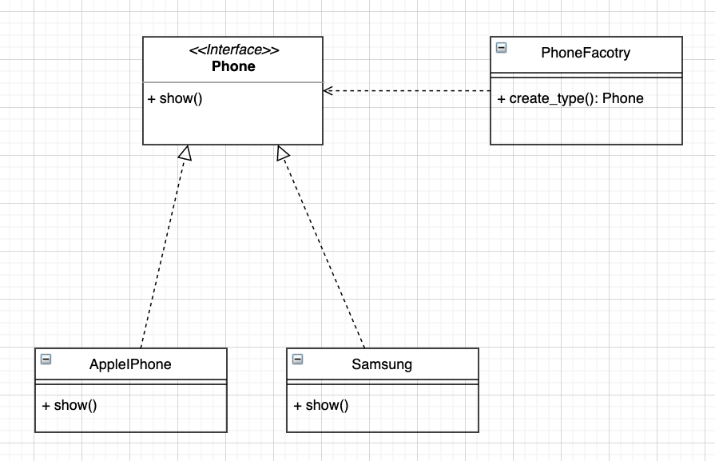

# Simple Factory Design Pattern

# test
add a .replit file with following lines
```
language = "python3"
run = "python -m unittest discover -v"
```

# UML
To use https://app.diagrams.net/ to open SimpleFactoryDiagram.drawio file for editing.

# Class Diagram
